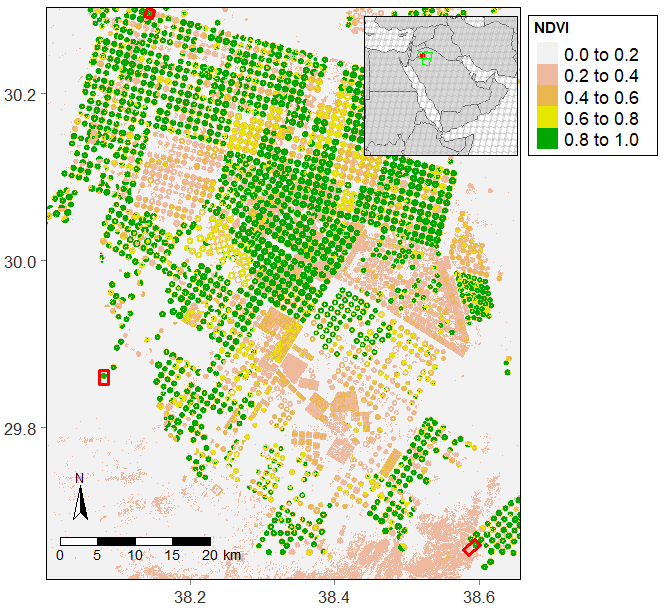

# Online Resource 1: Locally adaptive change-point detection with applications to remote sensing and land use changes


This repository provides the corresponding data-sets and R codes of
_"Locally adaptive change-point detection with applications to remote sensing and land use changes"_
by Moradi et al. (2020).

## Table of contents

 - [Package installation](#Package-installation)
 - [Simulations](#Simulations)
 - [Real case-study](#Real-case-study)
 - [References](#References)

# Package installation

```
# remote package
library(remote)

# install from github
instal_github(mmontesinosanmartin/change_point/LACPD)

```

# Simulations 


# Real case-study

## Dataset

The real case study aims to detect the transformation of bare land into cultivated areas in the Wadi As-Sirham valley, Saudi Arabia (Figure 1). The detection is based on a time-series of yearly NDVI scenes obtained from Landsat 4-8 satellites Collection 1 Level 2 surface reflectance imagery (U.S. Geological Survery, 2020) plus the application of the maximum value compositing technique (Holben, 1986) on a yearly basis. 

<p align="center">
  
  <p align="center"> Figure 1: Wadi As-Sirham valley in Saudi Arabia. The map shows the maximum value composite (MVC) for the region in 2019 from Landsat 8 scenes. The crop fields involved in the analysis are framed by red rectangles: Fields 1, 2, and 3 are located in the north, south-east, and west in the region of interest respectively. The smaller graph on the top-right corner shows the location of the valley within Saudi Arabia. The graph was produced with the tmap package (Tennekes. 2018).</p>
</p>

The data is available
[here](https://github.com/mmontesinosanmartin/changepoint_article/tree/master/Real_study/data).
The folder has the following files:

 - `field1_7.RData`: the dataset for the agricultural field beginning its activity in 1992.
 - `field2_21.RData`: the dataset for the agricultural field beginning its activity in 2006.
 - `field3_29.RData`: the dataset for the agricultural field beginning its activity in 2014.

Each `.RData` contains:

 - `sample.roi`: a `sf` delimiting the boundaries of the study area for each field (red rectangles in Figure 1).
 - `sample.val`: a `RasterBrick` of 34 layers with the NDVI time series.
 - `this.data`: a `matrix` with the values from `sample.val`. Rows and columns represent pixels and years.

## R Code

The analysis and results of the real case study can be reproduced using the
`R` code avialable 
[here](https://github.com/mmontesinosanmartin/changepoint_article/tree/master/Real_study/r).
The folder contains the following sequence of scripts:

  - `1_lacpd_wadi.R`: applies the LACPD procedure (Moradi et al., 2020) to the time-series of NDVI images.
  - `2_graphs_wadi.R`: collects, organizes, and represents the results of the analysis.


# References

Holben, B.N. (1986). _Characteristics of maximum-value composite images from temporal AVHRR data_.
International journal of remote sensing, __7(11)__, 1417-1434 pp. Taylor $\&$ Francis.

Moradi et al. (2020). _Locally adaptive change-point detection with applications to remote sensing and land use changes_. Submitted for  publication.

Tennekes M (2018). _tmap: Thematic Maps in R._ Journal of Statistical Software, __84(6)__, 1-39. doi: 10.18637/jss.v084.i06 (URL:https://doi.org/10.18637/jss.v084.i06).

U.S. Geological Survey (2020). _Landsat Level- 2 Surface Reflectance Science Product_. (URL:https://www.usgs.gov/land-resources/nli/landsat/landsat-collection-1-surface-reflectance)


